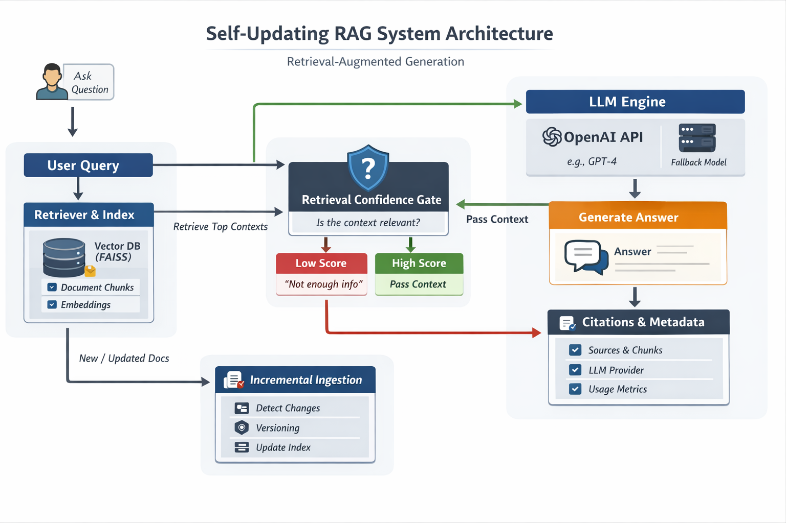

# 🔄 Self-Updating RAG System

A production-style **Retrieval-Augmented Generation (RAG)** system that automatically keeps its knowledge fresh by **incrementally re-indexing only changed documents**, while providing **accurate, traceable, and safe answers** using Large Language Models.

---

## 🚀 Project Purpose

Large Language Models (LLMs) are powerful, but they:
- Have **static knowledge**
- Can **hallucinate**
- Cannot natively reason over **private or frequently changing documents**

This project demonstrates how to solve those problems by building a **self-updating RAG system** that:

- Answers questions using **your own documents**
- Automatically **detects document changes**
- Re-indexes **only the modified chunks** (not the entire corpus)
- Prevents hallucinations using **retrieval confidence gating**
- Supports **versioning, rollback, and diffs** for transparency
- Clearly shows **whether OpenAI or local logic generated the answer**

The goal is to showcase **real-world GenAI engineering**, not just a chatbot.

---

## 🧠 What is RAG (Retrieval-Augmented Generation)?

**Retrieval-Augmented Generation (RAG)** combines two components:

1. **Retrieval**
   - Search a knowledge base (documents, PDFs, policies, logs, etc.)
   - Retrieve only the most relevant chunks for a query

2. **Generation**
   - Pass the retrieved context to an LLM
   - Generate a grounded answer **only using that context**

### Why RAG?
| Problem | Without RAG | With RAG |
|------|------------|---------|
| Private data | ❌ Not accessible | ✅ Fully supported |
| Up-to-date info | ❌ Model is stale | ✅ Always fresh |
| Hallucinations | ❌ Common | ✅ Strongly reduced |
| Explainability | ❌ None | ✅ Citations + traceability |

---

## 🎯 What This Project Achieves

This system goes beyond basic RAG demos and focuses on **production-grade concerns**.

### ✅ Key Capabilities

#### 1. Incremental / Self-Updating Ingestion
- Documents are **hashed**
- Only **changed chunks** are re-embedded
- Removed chunks are deleted from the index
- Versions are automatically incremented

#### 2. Retrieval Confidence Gating
- Low-relevance queries are rejected
- Out-of-scope questions return:
  > *“I don’t have enough information in the indexed documents to answer that.”*

This prevents hallucinations and unsafe answers.

#### 3. Live Document Editing
- Upload multiple documents from the UI
- Edit documents live
- Re-ingest and immediately see updated answers

#### 4. Versioning, Rollback & Diff
- Every ingest creates a new document version
- Roll back to older versions instantly
- View **chunk-level diffs** between versions

#### 5. Clear LLM Transparency
Each answer includes metadata:
```json
{
  "llm_provider_used": "openai",
  "model_used": "gpt-4o-mini",
  "openai_request_id": "...",
  "usage": {
    "prompt_tokens": 312,
    "completion_tokens": 84
  }
}
```

## 🧩 System Architecture



This diagram shows how user queries flow through retrieval, confidence gating,
LLM generation, and incremental ingestion with versioning.

## Quick Start (works without API keys)

### Install
```bash
python -m venv .venv
source .venv/bin/activate   # Windows: .venv\Scripts\activate
pip install -r requirements.txt
```

### Run backend
```bash
cd backend
uvicorn app:app --reload --port 8000
```

### Run demo UI
In another terminal:
```bash
cd frontend
streamlit run streamlit_app.py
```

Open Streamlit, click **Ingest / Update Index**, then start asking questions.


## Using OpenAI for best answers (recommended)

The demo works without an API key (fallback mode), but you'll get the cleanest, most "assistant-like" answers with OpenAI.

Set these environment variables before starting the backend:

```bash
export OPENAI_API_KEY="YOUR_KEY"
export LLM_PROVIDER="openai"
export EMBED_PROVIDER="openai"
# Optional:
export OPENAI_MODEL="gpt-4o-mini"
export OPENAI_EMBED_MODEL="text-embedding-3-small"
```

Then restart the backend.

## Environment (.env)
Copy `.env.example` to `.env` and set `OPENAI_API_KEY`. The backend loads `.env` automatically.
